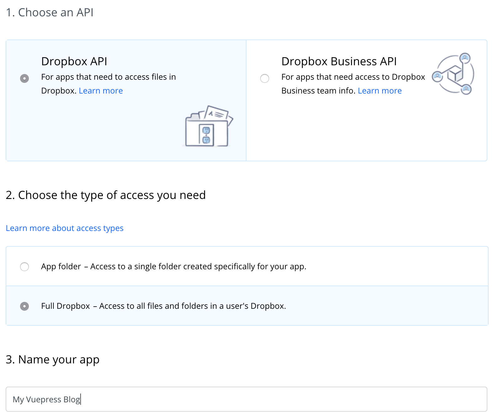

# Dropbox Paper CMS

[](https://www.npmjs.com/package/dropbox-paper-cms)
[](https://david-dm.org/pterobyte/dropbox-paper-cms)
[](https://lgtm.com/projects/g/Pterobyte/dropbox-paper-cms/context:javascript)
[](https://github.com/pterobyte/dropbox-paper-cms/master)
[](https://github.com/prettier/prettier)
[](https://opensource.org/licenses/MIT)
[](https://app.fossa.com/projects/git%2Bgithub.com%2FPterobyte%2Fdropbox-paper-cms?ref=badge_shield)

Using [Dropbox Paper APIs](https://dropbox.github.io/dropbox-api-v2-explorer/) to generate static content your CMS website

*WARNING*: Sidebar auto-generation currently only compatible with vuepress


Dropbox Paper CMS was developed so that CMS sites could easily update their content without writing any code. One only needs to write documents in [Dropbox Paper](https://paper.dropbox.com/), and Dropbox Paper CMS  will fetch documents in markdown, save them locally, then optionally update your CMS sidebar with new file paths (currently only available for vuepress, [PRs welcome](https://github.com/pterobyte/dropbox-paper-cms/.github/CONTRIBUTING.md/.github/CONTRIBUTING.md)).

## Contents  

- [Getting Started](#getting-started)
- [API Reference](#api-reference)
  - [Docs Schema](#docs-schema)
  - [fetchPaperDocs](#fetchpaperdocs)
  - [generateContent](#generateContent)
  - [generateConfig](#generateConfig) *experimental*
- [Examples](#examples)
- [Limitations](#limitations)
- [Contributing](#contributing)
- [Authors](#authors)
- [License](#license)
- [Acknowledgments](#acknowledgments)

## Getting Started

### Install

- With NPM

  ```sh
  npm install dropbox-paper-cms
  ```

- With Yarn

  ```sh
  yarn add dropbox-paper-cms
  ```

### Generate Dropbox Paper API Token

- Go to your [Dropbox App Console](https://www.dropbox.com/developers/apps)

- Create a new App



- Generate an access token


## API Reference

### Docs Schema

Each API makes use of this custom schema for your Dropbox Paper documents. Since the Dropbox Paper APIs do not provide a convenient way to fetch and manage content, this module attempts to alleviate that by providing a standard schema to use as you like with all your Dropbox Paper files.

```js
[
  {
    id: 'string',
    folders: [
      {
        id: 'string',
        name: 'string'
      }
    ],
    metaData: JSON,
    content: JSON,
    location: 'string'
  }
]
```

### fetchPaperDocs

Fetches dropbox paper files and metaData from a list of dropbox folders and returns documents in a promise.

#### Parameters

`{Options}`

Pass an options object into the `fetchPaperDocs` function

```js
{
  dropboxApiToken: 'string',
  contentDir: 'string',
  folders: [ 'string' ]
}
```

| Option              | Type            | Description                                                                             | Example                                               |
|-------------------  |---------------  |---------------------------------------------------------------------------------------  |------------------------------------------------------ |
| dropboxApiToken     | String          | Token generated from your Dropbox Paper App Console                                     | bwgnBMfB-LFFFYDNIYVb1zC6J6kBkvp_FwvISvJp989Tm9dx      |
| contentDir          | String          | Name or path of the directory you want dropbox-paper-cms to write markdown files to     | 'content'                                             |
| folders            | [String]   | An array of folder names matching the folders in your Dropbox Paper directory              | ['blog', 'portfolio', 'guide']

#### Returns

Promise<[Docs](#docs-schema)>

### generateContent

Writes Dropbox Paper docs to local markdown files using node's filesystem module

#### Parameters

[Docs](#docs-schema), `contentDir`

Parameter        | Type                          | Description                                 | Example          |
|--------------  |-----------------------------  |---------------------------------------------|----------------- |
| Docs           | [Docs](#docs-schema)          | Docs returned from `fetchPaperDocs`         |                  |
| contentDir     | String                        | Path to your static content directory       | './content'      |

#### Returns

Promise<[Docs](#docs-schema)>

### generateConfig

Writes Dropbox Paper docs to local markdown files using node's filesystem module

#### Parameters

[Docs](#docs-schema), `config`

Parameter        | Type                          | Description                                 | Example                          |
|--------------  |-----------------------------  |---------------------------------------------|--------------------------------- |
| Docs           | [Docs](#docs-schema)          | Docs returned from `fetchPaperDocs`         |                                  |
| config         | JSON                          | Config file for your static site generator  | require('./.vuepress/config.js') |

#### Returns

Promise<[Docs](#docs-schema)>

## Examples

```js
const paperCMS = require('dropbox-paper-cms')
const vueConfig = require('./content/.vuepress/config')

const contentDir = 'content'
const options = {
  contentDir,
  dropboxApiToken: 'bwgnBMfB-LFFFYDNIYVb1zC6J6kBkvp_FwvISvJp989Tm9dx ', // NOTE: keep this token secret
  folders: [
    'blog',
    'portfolio',
    'guide'
  ]
}

paperCMS
  .fetchPaperDocs(options)
  .then(docs => paperCMS.generateContent(docs, contentDir))
  .then(docs => paperCMS.generateConfig(docs, vueConfig)) // only compatible with vuepress for now
  .catch(console.error)
```

## Limitations

- Dropbox API App tokens only support full access to dropbox paper account instead of limiting access to a single folder. This is why  you must specify the folders to match the corresponding folders in your Dropbox Paper account.

- For now, sidebar content only generated in vuepress configuration files, so manual configuration is required for other static site generators.

- Content is sorted alphabetically (or alphanumerically), but future versions will allow configuration.

- Paper has no webhooks or other mechanism to trigger a new publication on document changes. (See acknowledgements below for a guide on publishing through slack)

## Contributing

Please read [CONTRIBUTING.md](https://github.com/pterobyte/dropbox-paper-cms/.github/CONTRIBUTING.md/.github/CONTRIBUTING.md) for details on our code of conduct, and the process for submitting pull requests to us.

## Authors

- **JT Houk** - [Pterobyte](https://github.com/pterobyte)

## License

This project is licensed under the MIT License - see the [LICENSE](https://github.com/pterobyte/dropbox-paper-cms/LICENSE) file for details

[](https://app.fossa.com/projects/git%2Bgithub.com%2FPterobyte%2Fdropbox-paper-cms?ref=badge_large)

## Acknowledgments

This project was inspired by a project by [De Voorhoede](https://github.com/voorhoede/playbook) on using Dropbox Paper as a Content Management System.

[Guide to publish using slack webhooks](https://www.voorhoede.nl/en/blog/dropbox-paper-as-a-headless-cms/)